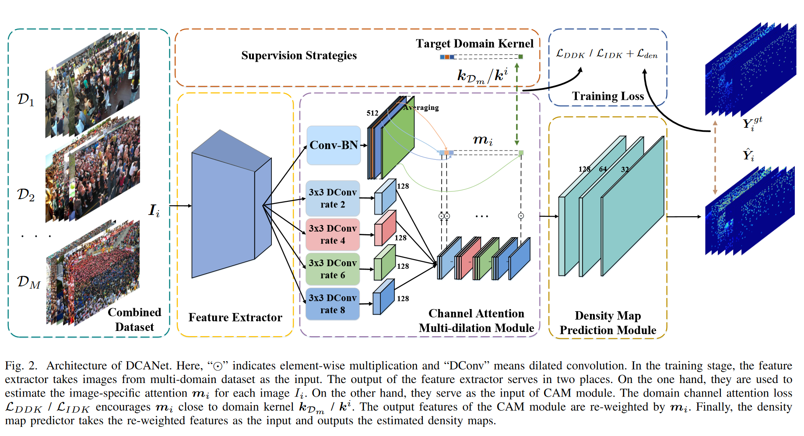

# DCANet




# Datasets Preparation
Download the datasets `ShanghaiTech A`, `ShanghaiTech B` and `UCF-QNRF`
Then generate the density maps via `generate_density_map_perfect_names_SHAB_QNRF_NWPU_JHU.py`.
After that, create a folder named `JSTL_large_dataset`, and directly copy all the processed data in `JSTL_large_dataset`.

The tree of the folder should be:
```bash
`DATASET` is `SHA`, `SHB` or `QNRF_large`.

-JSTL_large_dataset
   -den
       -test
            -Npy files with the name of DATASET_img_xxx.npy, which logs the info of density maps.
       -train
            -Npy files with the name of DATASET_img_xxx.npy, which logs the info of density maps.
   -ori
       -test_data
            -ground_truth
                 -MAT files with the name of DATASET_img_xxx.mat, which logs the original dot annotations.
            -images
                 -JPG files with the name of DATASET_img_xxx.mat, which logs the original image files.
       -train_data
            -ground_truth
                 -MAT files with the name of DATASET_img_xxx.mat, which logs the original dot annotations.
            -images
                 -JPG files with the name of DATASET_img_xxx.mat, which logs the original image files.
```

Download the pretrained hrnet model `HRNet-W40-C` from the link `https://github.com/HRNet/HRNet-Image-Classification` and put it directly in the root path of the repository.

After doing that, download the pretrained model via
```bash
bash download_models.sh
```
And put the IDK model into folder './output', change the model name in `test.sh` or `test_fast.sh` scripts.

# Test
```bash
sh test.sh
```
Or if you have two GPUs, then
```bash
sh test_fast.sh
```

# Training
As the whole training of our pipeline is a little bit complex. So we put the whole code of the pipeline into different main folders. Follow the steps below:

1. You need to the baseline of DCANet in the folder `Phase1_JSTL`, `JSTL` indicates train all the images from the observed domains together. 

2. Then you can use `Phase2_Get_weight` or `Phase2_Get_weight_Fast` to extract $\Delta M\!A\!E$ for each channel for each image. The code in `Phase2_Get_weight` is the navie extractly implementation directly upon the definition, however, it is quite slow.
The code in `Phase2_Get_weight_Fast` is much faster.

3. After obtaining the indicators, go to `Phase_Cal_domain` and select the suitable script on your own. Then you can get the domain kernels recorded in the file `*.npz`. 

4. Copy `*.npz` to `Phase3C_guided_training` for `DDK` training. You should copy the baseline model into the folder and load the pretrained weights for further DDK training.
You can get the instructions from the files `*.sh`.

5. After the model is trained, copy the model into `Phase3Cb_fast`, also copy `*.npz` to this folder, you can either perform IDK training directly from DCANet$_{base}$ or from DCANet (${\cal L}_D$).

6. You can also train/test WorldExpo or UCF\_CC\_50 in the folder `Phase0_Train_WE_And_Test_WE_UCFCC`.

# Mention
It is suggested that you should create soft links of `image folder`(e.g., `JSTL_large_dataset`) and `hrnet model`(i.e., `hrnetv2_w40_imagenet_pretrained`) in each main folder. Always, read `config.py` in each main folder if a path error occurs.


